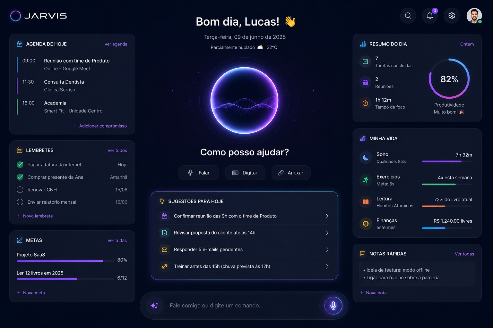

# JARVIS — Assistente Pessoal

Interface premium, dark mode e futurista para o assistente pessoal **JARVIS** — seu segundo cérebro digital. Construída com foco em simplicidade, clareza, produtividade e elegância.



## Stack

- [Vue 3](https://vuejs.org/) + [Vite](https://vite.dev/) (SPA)
- [TailwindCSS v4](https://tailwindcss.com/)
- [shadcn-vue](https://www.shadcn-vue.com/) (sobre [reka-ui](https://reka-ui.com/))
- [Motion](https://motion.dev/) (`motion-v`) para animações de entrada
- [GSAP](https://gsap.com/) para o orbe inteligente animado
- [lucide-vue-next](https://lucide.dev/) para ícones

## Pré-requisitos

É necessário ter o **Node.js 18+** e o **npm** instalados.

```bash
# Ubuntu/Debian, por exemplo:
sudo apt install nodejs npm
# ou via nvm (recomendado): https://github.com/nvm-sh/nvm
```

## Como rodar

```bash
npm install
npm run dev
```

Acesse o endereço exibido no terminal (por padrão `http://localhost:5173`).

### Outros comandos

```bash
npm run build      # build de produção
npm run preview    # pré-visualizar o build
npm run type-check # checagem de tipos
```

## Estrutura

```
src/
├── App.vue                  # Orquestra header + grid + command bar
├── main.ts
├── assets/css/main.css      # Tema dark, tokens neon e glassmorphism
├── components/
│   ├── layout/              # AppHeader, DashboardGrid, CommandBar
│   ├── orb/                 # AssistantOrb (animado com GSAP)
│   ├── cards/               # Agenda, Lembretes, Metas, Sugestões, Resumo, Minha Vida, Notas
│   └── ui/                  # Componentes base (Button, Input, Avatar, Badge, Progress)
├── composables/
│   ├── useAssistant.ts      # Máquina de estados (idle/listening/thinking/responding)
│   └── useGreeting.ts       # Saudação + data em pt-BR
└── data/mock.ts             # Dados mockados do dashboard
```

## O orbe inteligente

O `AssistantOrb` reage a quatro estados, controlados por `useAssistant()`:

- **Ouvindo** (`listening`) — forma de onda ampla e reativa
- **Pensando** (`thinking`) — rotação acelerada e shimmer
- **Respondendo** (`responding`) — pulso de fala
- **Repouso** (`idle`) — respiração suave

Experimente clicar no botão **Falar**, nas **Sugestões** ou digitar um comando na caixa inferior para ver as transições. Respeita `prefers-reduced-motion`.

> Dados são mockados (`src/data/mock.ts`) — esta entrega foca na experiência visual e na hierarquia da interface.
